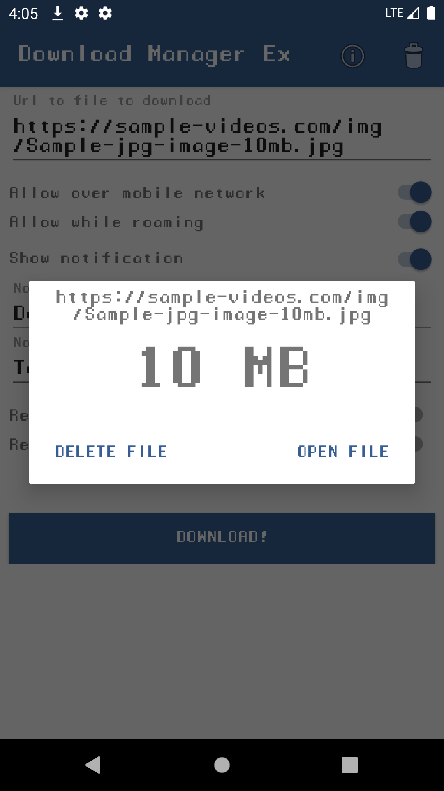

# Download Manager Exploration

<p align="center">
  
   
</p>

Download Manager Exploration is an app created to show the usage and the functionality of Android' component Download Manager.

# Installation
Just download the project and open it with Android Studio.

# Maintainers
This project is created and mantained by:
* [Daniele Bachicchi](http://github.com/badge87)

# License

```

Copyright 2019 Daniele Bachicchi

   Licensed under the Apache License, Version 2.0 (the "License");
   you may not use this file except in compliance with the License.
   You may obtain a copy of the License at

       http://www.apache.org/licenses/LICENSE-2.0

   Unless required by applicable law or agreed to in writing, software
   distributed under the License is distributed on an "AS IS" BASIS,
   WITHOUT WARRANTIES OR CONDITIONS OF ANY KIND, either express or implied.
   See the License for the specific language governing permissions and
   limitations under the License.
   
```
